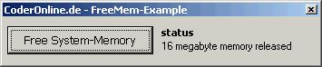



## make system memory aviable

### Description

It completely fills your Memory with Data. Windows than cleans up its memory automatically. The effect is that after releasing the memory again more memory is aviable than before.

This is a popular method that is used by many RAM-Cleaners, but I have never seen it as VB-Code.
 
### More Info
 
its all included but if your experienced just unzip the Module1.bas and execute the FreeMem-function inside.

please do not execute the code twice (you know why...) :-)

The FreeMem-Function returns how many Megabytes of memory were released.

After releasing memory some applications have to load their data again. In short: You will recognize that you system is running slower after the cleanup and the harddrive-activity increases, although you have more memory aviable.

             |
---                |---
**Submitted On**   |2004-04-13 11:08:52
**By**             |[Max Christian Pohle](https://github.com/Planet-Source-Code/PSCIndex/blob/master/ByAuthor/max-christian-pohle.md)
**Level**          |Intermediate
**User Rating**    |4.2 (21 globes from 5 users)
**Compatibility**  |VB 3\.0, VB 4\.0 \(16\-bit\), VB 4\.0 \(32\-bit\), VB 5\.0, VB 6\.0
**Category**       |[Windows API Call/ Explanation](https://github.com/Planet-Source-Code/PSCIndex/blob/master/ByCategory/windows-api-call-explanation__1-39.md)
**World**          |[Visual Basic](https://github.com/Planet-Source-Code/PSCIndex/blob/master/ByWorld/visual-basic.md)
**Archive File**   |[make\_syste1733034132004\.zip](https://github.com/Planet-Source-Code/max-christian-pohle-make-system-memory-aviable__1-53116/archive/master.zip)

